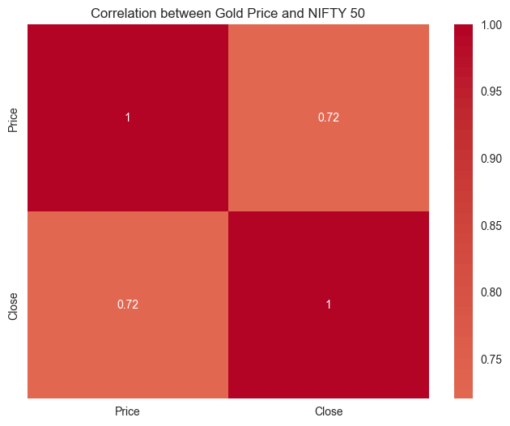

# NIFTY-GOLD_Price_EDA
This project performs an exhaustive statistical analysis between NIFTY-50 and Gold Prices from FY-16 till FY-22

1. The initial aim for this project is to co-relate the price fluctuation between NIFTY-50 and gold.

First we do an inital co-relation between the NIFTY-day Close price and Gold Price daily.

- From the above diagram it is evident that gold is positively correlated with NIFTY-50 Index, that means if NIFTY increases then gold prices increases as well but not as much, but when NIFTY decreases gold prices do take the hit but stay relatively stable.

2. Then we try to plot the time series data plot for both the asset classes to see the trend between the data.

From the above image it is clear that when NIFTY is about to break-even with gold from a Bullish run then investing in gold might lead to substantial gains during a bearish market trend.

3. Next we try to observe the seasonality pattern for Gold vs NIFTY during FY16-FY22

- For this analysis we use a daily percentage_change to observe the daily returns and then calculate a 30-day rolling correlation between the returns of both the asset classes.

From the above analysis it shows that gold prices correct atleast 3 times a year, but if we see the daily percentage change gold is less volatile than NIFTY-50

4. Then we perform a Granger Causality Test on the two asset classes.

- The Granger causality test is a statistical method used to determine if one time series can be used to predict another, meaning that past values of one variable can help predict future values of another, but not vice versa. It's a way to assess potential causal relationships between variables in time series data.  
  - We assume a max_lag of 5
 

Granger analysis shows us that the asset classes are not directly following a linked pattern among themselves; rather they are related to each other by certain market regime's like( Bearish, Bullish)

5. That's why we perform a Regime analysis to show how the asset classes behave in different market regime's

- In statistics, regime analysis, also known as regime switching or regime-switching models, examines time series data that may exhibit different behaviors or "regimes" over time, acknowledging that the statistical properties of the data can change.
- Broadly there is two market regime's
  - Bullish (When Equity markets like NIFTY are on the rise)
  - Bearish (When Equity markets like NIFTY are on the fall or as we call it market correction)
  - Finally we see a neutral regime when the market consolidates.

From the above analysis we can see that the volatility of gold is less, and gold almost never gives a negative return even during the worst NIFTY returns phase.

